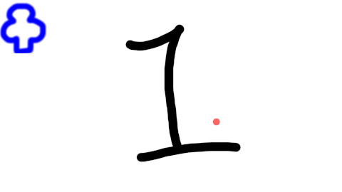
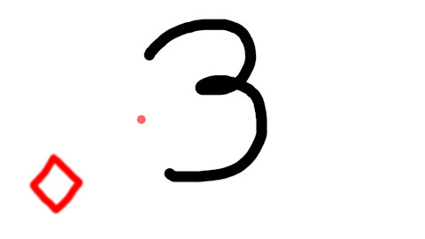

# SlideOne

A slide show library for html/javascript

# The constructor

## SlideOne

| parameter | description |
|--|--|
| canvas | A target canvas id or canvas element |
| slideOneSource | Image sources. It could be an array of image names or an object described bellow |

### slideOneSource

| property | description |
|--|--|
| bg | A back ground image file (optional) |
| slides | Image names or slide objects. |
| fullWindow | Resize drawing area automatically. (optional, default = true) |
| enableMouseDownEvent | (optional, default = true) |
| enableKeyDownEvent | (optional, default = true) |
| loop | (optional, default = true) |
| showCursor | Show or hide the cursor. If it is true, a red circle follow your mouse cursor on drawing area. (optional, default = true) |

### slide object

| property | description |
|--|--|
| image, img, i | image file name. |
| x | x position. (optional, default = 0) |
| y | y position. (optional, default = 0) |
| w | width. (optional, default = -1) |
| h | height. (optional, default = -1) |
| anchor, a | Anchor. The possible values are "topleft", "top", "topright", "left", "center", "right", "bottomleft", "bottom", or "bottomright". (optional, default = "topleft") |

# Methods

## Start

Start to load and draw images.

| parameter | description |
|--|--|
| onLoadCallback | A callback function called after loading. (optional) |

# Usage

## Example1

```html
<canvas id="canvas" width="1920" height="1080" style="display: block; margin: auto;  position: absolute; top:50%; left:50%; transform: translate(-50%, -50%);"></canvas>
<script src="../SlideOne.js"></script>
<script>
    const canvas = document.getElementById("canvas");
    const slide = new SlideOne(canvas, ["images/1.jpg", "images/2.jpg", "images/3.jpg", "images/4.jpg"]);
    slide.start();
</script>
```

## Example2

```html
<canvas id="canvas" width="1920" height="1080" style="display: block; margin: auto;  position: absolute; top:50%; left:50%; transform: translate(-50%, -50%);"></canvas>
<script src="../SlideOne.js"></script>
<script>
    const parameter = [
        ["images/1.jpg", "images/clubs.png"],
        ["images/2.jpg", {image:"images/spades.png", anchor:"topright"}],
        ["images/3.jpg", {i:"images/diamonds.png", a:"bottomleft", x:100, y:-100}],
        ["images/4.jpg", {i:"images/hearts.png", a:"bottomright"}]
    ];
    const slideOne = new SlideOne("canvas", parameter);
    slideOne.start();
</script>
```




